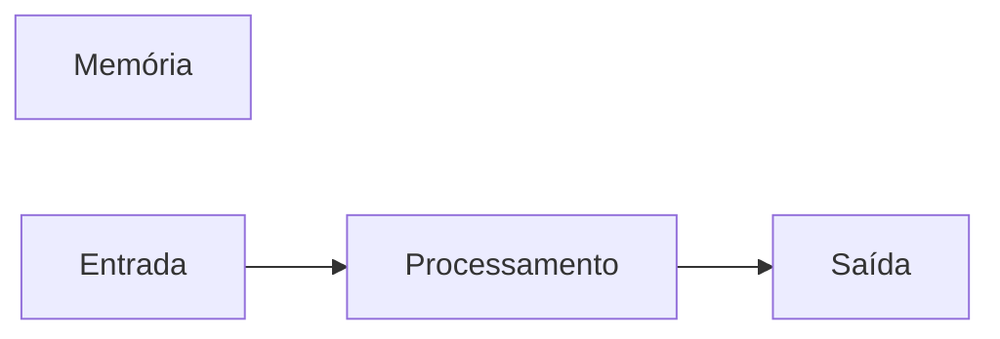

# JavaScript
Repositório usado para estudo da lógica de progamação com uso da linguagem JavaScript
## Autor
Mike de oliveira

---
## Variáveis
Variáveis são espaços na memória do computador usados para guardar valores que podem alterar ao longo do programa.
### Principais tipos primitivos:
- Strings (texto)
- Number (Números inteiros e não interiros)
- boolean (verdadeiro ou falso)

## Operadores Aritméticos

| Operador | Proposito | Exemplo | Resultado |
|----------|-----------|---------|-----------|
| = | Atribuir um valor | x = 10 | x = 10 |
| + | Somar | 10 + 5 | 15 |
| += | Somar e atribuir | x += 5 | x = 15 |
