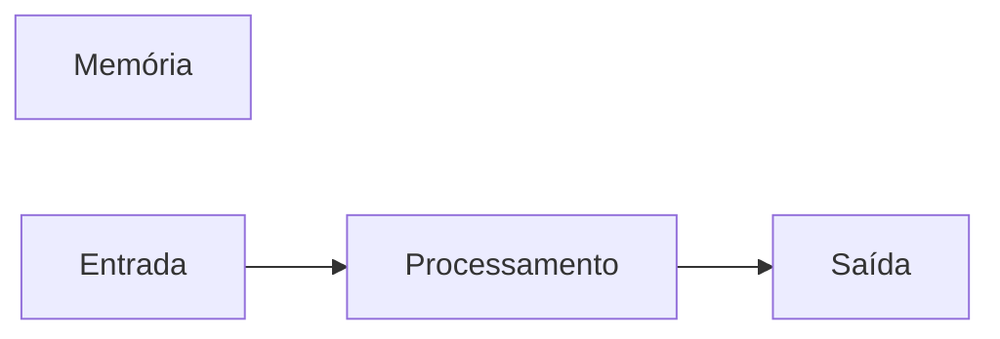

# JavaScript
Repositório usado para estudo da lógica de progamação com uso da linguagem JavaScript
## Autor
Mike de oliveira

---
## Variáveis
Variáveis são espaços na memória do computador usados para guardar valores que podem alterar ao longo do programa.
### Principais tipos primitivos:
- Strings (texto)
- Number (Números inteiros e não interiros)
- boolean (verdadeiro ou falso)

## Operadores Aritméticos

| Operador | Proposito | Exemplo | Resultado |
|----------|-----------|---------|-----------|
| = | Atribuir um valor | x = 10 | x = 10 |
| + | Somar | 10 + 5 | 15 |
| += | Somar e atribuir | x += 5 | x = 15 |
| - | Subtrair | 15 - 10 | 5 | 
| -= | Subtrair e atribuir | 15 -= 10 | x = 5 |
| * | Multiplicar | 5 * 4 | 20 |
| *= | Multiplicar e atribuir | x *= 4 | x = 20 |
| / | Dividir | 20 / 2 | 10 |
| /= | Dividir e atribuir | x /= 2 | 10 |
| ++ | Somar 1 ao resultado | x ++ | 11 |
| -- | Subtrair 1 do resultado | x-- | 10 |
| % | Resto da divisão | 10 % 3 | 1 |

## Operadores logicos
| Comparador | Simbologia  |
|------------|-------------|
| AND | && |
| OR | \| \| |
| NOT | ! |

## Comparadores
| Comparador | Significado |
|------------|-------------|
| > | Maior que |
| >= | Maior ou igual a |
| < | Menor que |
| <= | Menor ou igual a | 
| === | Idêntico a |
| !== | Nao idêntico a |
